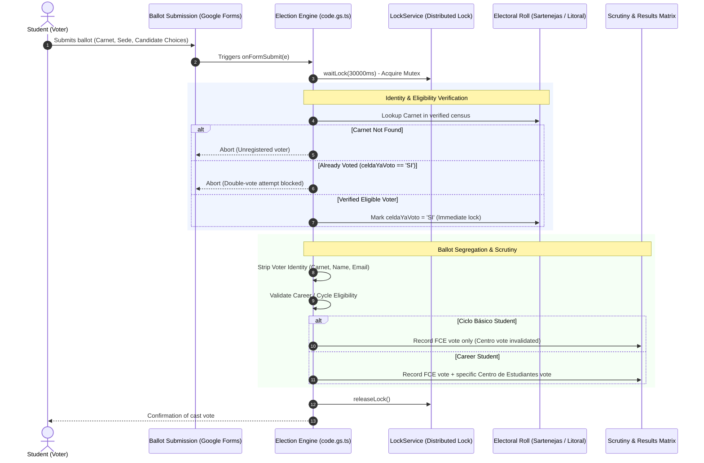

<div align="center">

# 🗳️ Sistema de Votaciones Estudiantiles USB (2025)

**Automated election infrastructure, anti-fraud ballot verification, and real-time scrutiny engine for Universidad Simón Bolívar.**

Deployed for the **Federación de Centros de Estudiantes (FCEUSB)** and academic **Centros de Estudiantes (CE)** across Sartenejas and Litoral campuses.

[](https://www.typescriptlang.org/)
[](https://developers.google.com/apps-script)
[](https://developers.google.com/apps-script/reference/lock/lock-service)
[](https://www.gnu.org/licenses/gpl-3.0)

</div>

---

## 📌 Overview

During university elections, student bodies require an electoral system that guarantees:
1. **Secret & Anonymized Balloting:** Mathematical dissociation of voter identity from cast ballots.
2. **Strict Identity Verification & Anti-Fraud Locking:** Single-vote enforcement verified in real time against university electoral rolls.
3. **Multi-Campus & Career Rule Filtering:** Dynamic eligibility based on campus (Sartenejas vs. Litoral) and academic cycle (Ciclo Básico vs. Ciclo Profesional).
4. **Race-Condition Safety:** Distributed locks handling concurrent ballot submissions during peak voting hours.

This repository contains the backend engine (`code.gs.ts`) powering the automated election pipeline, integrating Google Forms and Sheets via Google Apps Script with enterprise-level concurrency controls.

---

## 🏛️ System Architecture & Voting Flow



---

## 🛡️ Security Mechanisms & Core Logic

### 1. Distributed Concurrency Lock (`LockService`)
High-volume concurrent submissions during peak voting hours can trigger race conditions where two simultaneous submissions with the same student ID attempt to bypass the check. 
The system establishes a script-level mutex lock before any read/write transaction:
```typescript
const lock = LockService.getScriptLock();
try { 
  lock.waitLock(30000); // 30-second bounded timeout
} catch (e) { 
  Logger.log("[CONCURRENCY_ERROR] Lock acquisition timeout.");
  return; 
}
```

### 2. Multi-Tiered Eligibility Rule Engine
- **Ciclo Básico:** Students enrolled in foundational terms (`CODIGOS_BASICO: ["0", "00", "BASIC", "CICLO"]`) are only eligible to elect the Federation (`FCEUSB`). Any cast vote for an individual Centro de Estudiantes is programmatically trapped and tallied under the `Votos CE No Validos` audit ledger.
- **Ciclo Profesional:** Students are matched with their respective degree program (`CARRERAS_NOMINALES: ["0700" (Arquitectura), "1100" (Urbanismo), "1900" (Biología), ...]`) and allowed to cast votes for both Federation and their specific student center.
- **Sede del Litoral:** Automatic campus route detection redirecting queries to the Coastal Campus registry (`ID_REGISTRO_LITORAL`).

### 3. Identity Scrubbing (Democracy & Privacy)
To adhere to the Venezuelan university democratic charter, voter identification fields (`CARNET`, `CORREO`, `NOMBRE`) are filtered out prior to passing the vote matrix to the `RESULTADOS` sheet, making correlation between student identity and vote intention cryptographically infeasible.

---

## 📊 Technical Stack

- **Core Scripting:** TypeScript / Google Apps Script (ES6+ runtime).
- **Data Persistence:** Google Sheets API (Multi-tenant relational structure: Sartenejas Registry, Litoral Registry, Results Ledger).
- **Concurrency Management:** Google Apps Script `LockService`.
- **String Normalization:** Custom diacritics stripping, character sanitization, and intelligent zero-padded student ID formatting.

---

## ⚖️ License

Distributed under the **GNU General Public License v3 (GPLv3)**. Software developed for transparency and open-source auditability for the benefit of the university community.

---

## 👤 Author
**Victor Hernández**  
- Computer Engineering Student @ [Universidad Simón Bolívar (USB)](https://www.usb.ve/)
- GitHub: [@soyvistorrr](https://github.com/soyvistorrr)
- LinkedIn: [Victor Hernández](https://linkedin.com/in/victormhernandeza)
- Email: victormhernandeza3009@gmail.com
